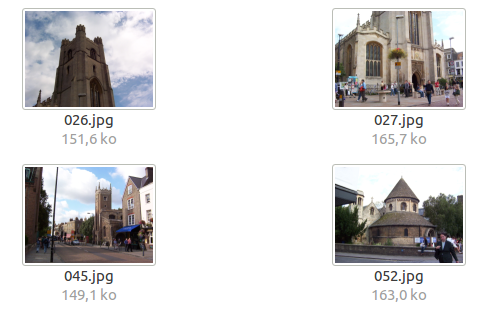

# Image classification as a service

*messed_path_to_classify.py* has been created by Loic MESSAL (Student at the French National School of Geomatics).
24 March 2016

Install python3 :
```sh 
$ sudo apt-get install python3 
```
> Currently, "sudo apt-get install python3" loads alias python3 as python3.4.
*messed_path_to_classify.py* uses python3.5 (for folder manager) and python3.4 (for artificial intelligence algorithm)


Install Tensorflow
	You need to install first pip3 for manage module	
```sh
	$ sudo apt-get install python3-pip python3-dev
```
Then, install Tensorflow :
```sh
	sudo pip3 install --upgrade <link>
```
> Choose your link on [tensorflow documentation](https://www.tensorflow.org/install/install_linux#the_url_of_the_tensorflow_python_package)
Because of some difficulties to install tensorflow with cuda and cudnn libraries, I used : 
> sudo pip3 install --upgrade https://storage.googleapis.com/tensorflow/linux/cpu/tensorflow-1.0.1-cp35-cp35m-linux_x86_64.whl


## Demonstration : 
I would love to sort my pictures from my holidays in Cambridge. I have a folder where I put all my cambridge holidays pictures... 


> In fact, these pictures are a groundtruth for computer vision algorithms from [Washington University](http://imagedatabase.cs.washington.edu/groundtruth/)

With this command, I am now able to sort my pictures into topical path
```
python3.5 messed_path_to_classify.py --out_path ./example/sorted ./example/cambridge
```

Here is the result of the classification : 


Oh dear god ! My computer analysed my picture and recognized by its own all the churches of my cambridge holidays pictures and put it in the same folder : 




# Create an alias
Place ImageDossier in the directory of your choice. Keep it in mind.
for exemple : /home/Intelligence/

Then, edit your alias file to use the messed_path_to_classify.py easily
```sh
$ nano ~/.bashrc
```
add this ending line : 
> alias classify_path="python3.5 /home/Intelligence/ImageDossier/messed_path_to_classify.py"

close the alias file by press ctrl+X and type 'O' and press enter


Now have fun and classify your folder ! 

## Usage : 
- Mainly used : 
```
classify_path --out_path ./sorted ./path_to_classify/
```

- Help :
```
classify_path -h
```

# TODO : 

- [x] Check if the code is working on Ubuntu 16
- [ ] Update installation part of the documentation
- [ ] Upgrade the code with the new tensorflow API : Op BatchNormWithGlobalNormalization is deprecated. It will cease to work in GraphDef version 9. Use tf.nn.batch_normalization() 
- [ ] Try with GPU tensorflow
- [ ] Parallelize image recognition (check with openMP ?)
- [ ] Build a dockerfile to transform the script as a service 
- [ ] Learn how to generate the model with my own data
- [ ] Create a responsive interface website (hosting the service) for no-computer-friendly people who want to sort their holiday pictures
- [x] Keep playing with Tensorflow
- [x] Star the github repository
- [x] Talk about this service to attract developers to contribute
- [ ] Revise this todo list
